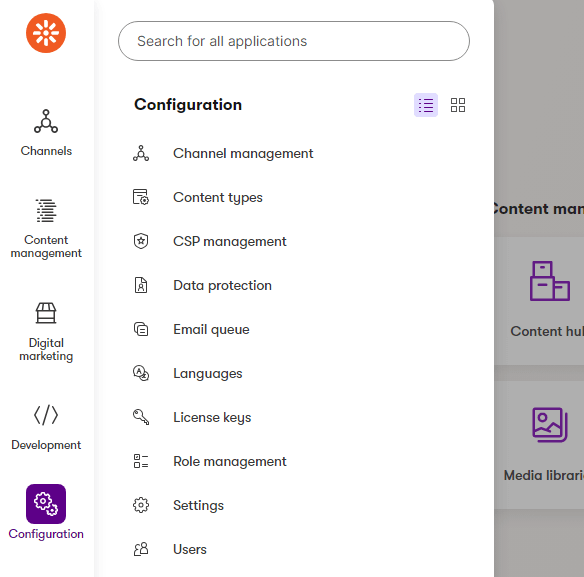
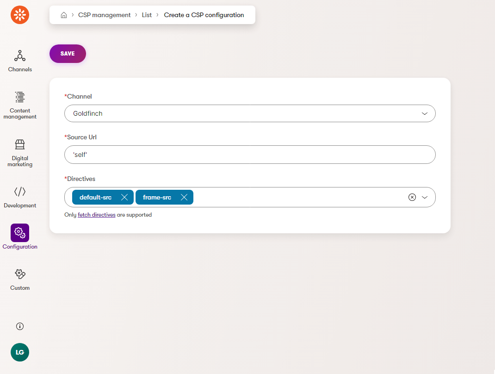
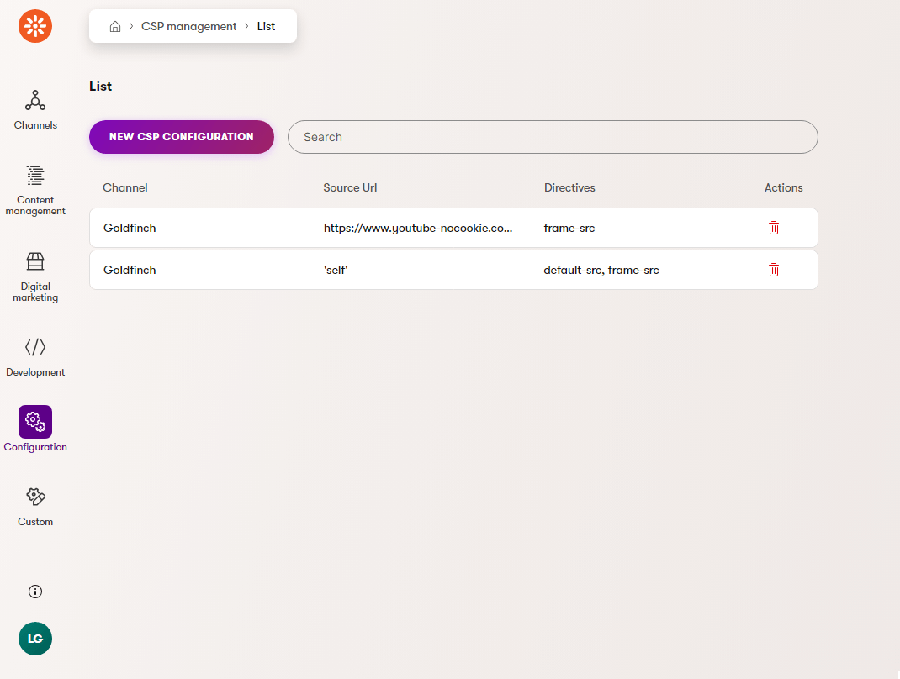

# Xperience Community: Content Security Policy (CSP) Management

## Description

Adds a module to the admin site for easy configuration of Content Security Policy (CSP) headers for web channels.

## Screenshots

Once installed, a new module appears in the navigation and the dashboard:
<a href="src/images/navigation-tile.png">
  
</a>

Screen for creating a new CSP configuration (on a per source url basis):
<a href="src/images/create-new.png">
  
</a>

Listing shows all configurations, including which web channel they are assigned to.
<a href="src/images/csp-listing.png">
  
</a>

## Library Version Matrix

| Xperience Version | Library Version |
| ----------------- | --------------- |
| >= 29.1.4         | 2.0.0           |
| >= 28.3.0         | 1.0.0           |

## Dependencies

- [ASP.NET Core 8.0](https://dotnet.microsoft.com/en-us/download)
- [Xperience by Kentico](https://docs.xperience.io/xp/changelog)

## Package Installation

Add the package to your application using the .NET CLI

```powershell
dotnet add package XperienceCommunity.CSP
```

## Quick Start

1. Install NuGet package above.

1. Add the following configuration to your `appsettings.json`:

   ```json
    {
      "ContentSecurityPolicy": {
        "EnableReporting": true,
      }
    }
   ```
   
    - `EnableReporting`: Set to `true` to enable reporting mode. This allows the system to capture requests that violate existing CSP headers, and shows this information within the reporting area of the CSP module. Defaults to `false`.
        - Automatically adds [report-to](https://developer.mozilla.org/en-US/docs/Web/HTTP/Headers/Content-Security-Policy/report-to) to CSP headers.
        - Logs any violation reports to the module's logging table.

1. Register the CSP management services using `builder.Services.AddXperienceCommunityCspManagement()`:

   ```csharp
   // Program.cs

   var builder = WebApplication.CreateBuilder(args);

   builder.Services.AddKentico();

   // ...

   builder.Services.AddXperienceCommunityCspManagement();
   ```


1. Register the CSP management middleware using `app.UseXperienceCommunityCspManagement()`:

   ```csharp

    var builder = WebApplication.CreateBuilder(args);

    // ...

    builder.Services.Configure<ContentSecurityPolicyOptions>(builder.Configuration.GetSection("ContentSecurityPolicy"));

    var app = builder.Build();

    app.UseKentico();

    // ...

    app.UseXperienceCommunityCspManagement();
   ```

1. That's it, launch your website and the module should be installed ready to go! Once you've configured your CSP headers, load a page on the website and check the headers in your browser console.


## CSP Nonce Support

This module supports the use of nonces in your CSP headers.

When creating a new CSP configuration, you can enable or disable a nonce being added for the selected directives. This will add a nonce to the header.

You are responsible for adding the nonce to your inline scripts and styles. You can use the `CspNonceService` to get the current nonce value. This service can be injected into your services, controllers, or views.

```csharp
public class MyService
{
    private readonly ICspNonceService _cspNonceService;

    public MyService(ICspNonceService cspNonceService)
    {
        _cspNonceService = cspNonceService;
    }

    public string GetNonce()
    {
        return _cspNonceService.Nonce;
    }
}
```

## Contributing

Feel free to submit issues or pull requests to the repository, this is a community package and everyone is welcome to support.

## License

Distributed under the MIT License. See [`LICENSE.md`](LICENSE.md) for more information.